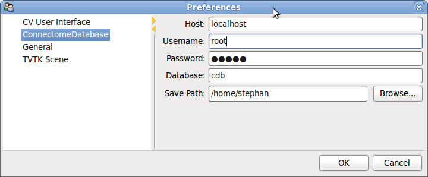

.. _cdb:

=====================================================
Setup and Usage of the ConnectomeDatabase and Plugin
=====================================================

Currently, what is meant by the ConnectomeDatabase is just a MySQL database.
How to setup such a database and how to manage (e.g. with PhpMyAdmin) is covered elsewhere.
The ConnectomeDatabase structure is not very sophisticated at the moment. It basically
exposes the metadata that are included in a ConnectomeFile, and stores an URL
to where the actual datasets can be downloaded locally.

The advantage of having such a ConnectomeDatabase setup is to have central repository
of connectome data to ease sharing of connectome files within a lab. And it is also possible
then to share the data across labs. Some rudimentary search mechanism lets you select only
particular files you need for your study.

There are many ways one could enhance the functionality of this basic ConnectomeDatabase
setup. E.g. load the data directly into the ConnectomeViewer (not need to store a local
copy), meta-analysis across studies, query of particular connections within connectome files.

.. note:: There are no specific security mechanisms installed. Be careful not to
    expose connectome files on a public accessible URL that you do not want to. Also the
    login data to your database is stored in plain-text. You want to limit the access rights
    of the user to only reading.

So far, the only table that we need to create is *cff_index*. You can achieve
this by the following SQL command.::

  CREATE TABLE IF NOT EXISTS `cff_index` (
  `id` int(11) NOT NULL auto_increment,
  `name` varchar(100) NOT NULL,
  `species` varchar(50) NOT NULL COMMENT 'binomial nomenclature, connectome wiki conform',
  `legalnotice` varchar(300) default NULL COMMENT 'usage of the dataset',
  `reference` varchar(300) default NULL COMMENT 'reference for this dataset',
  `description` text NOT NULL,
  `nrofnetworks` int(11) NOT NULL,
  `url` varchar(300) default NULL,
  `generator` varchar(50) NOT NULL,
  `cfile_url` varchar(300) NOT NULL,
  `created` date NOT NULL,
  `modified` date NOT NULL,
  PRIMARY KEY  (`id`)) ENGINE=MyISAM  DEFAULT CHARSET=latin1 AUTO_INCREMENT=10 ;

    
As described in the installation notes, you need to have a working client interface
for MySQL for Python. Currently, we use `PyMySQL <http://code.google.com/p/pymysql/>`_
for its simplicity. You have installed it with::

    sudo easy_install PyMySQL
    
When you start up the ConnectomeViewer in verbose mode (*-v* parameter), you should
see a line that reads like:

    INFO - root - Added ConnectomeDBPlugin (using PyMySQL)

This means that the ConnectomeDatabase plugin is working.

To get access to your database, you have to configure it first. This is done in the
preferences menu (*Tools->Preferences*):

You should now be able to connect to your database using the menu *Plugins->Database->ConnectomeDatabase*.
An interface pops up that let you see all the datasets that are in your database.

.. figure:: ../../_static/cdbplugin.png

You can select the datasets you like to download and click *OK*. The connectome files
are downloaded to the path you specified in the preferences. You can then open and
further process them.
